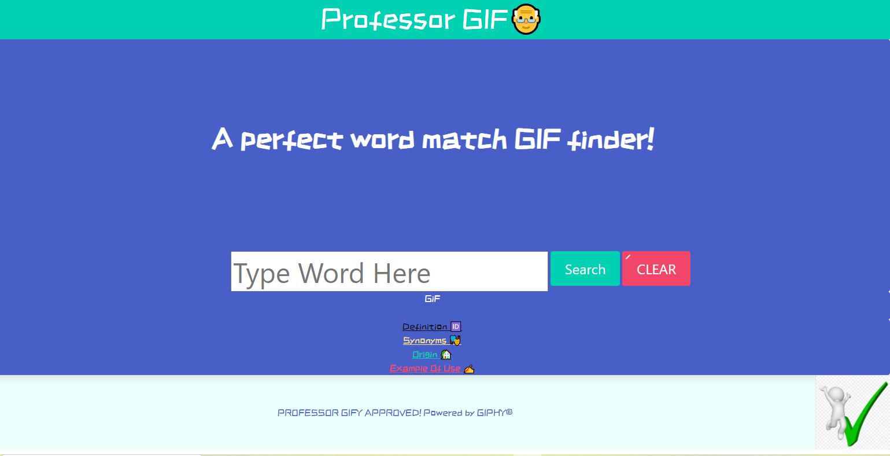

# professor-gif

<<<<<<< HEAD

1. [link to LIVE site](https://liladobe.github.io/professor-gif/)
2. [GitHub](https://github.com/LilAdobe/professor-gif)


## User Story 

```
As a speaker of the English language,
I want to improve my vocabulary
So that I can express myself better

```

## Acceptance Criteria 

```
GIVEN a word search engine 
WHEN I search for a word 
THEN I am presented the word and a corresponding GIF
WHEN I view the word
THEN I am presented with its definition, synonyms, origin, and example of use
WHEN I type a word
THEN it is saved in a local storage

```


## Screenshots 
Screenshot is listed below 




## languages 

```
HTML
CSS
JavaScript

```


## Framework

BULMA CSS

## Team

```
Lajaynees Ingram
Alexis Guzman
Jacquez Patterson
Jonathan Bokungu

```
